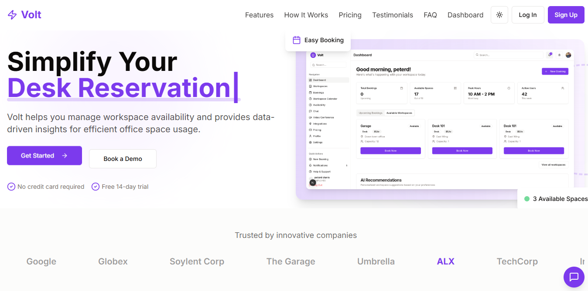

# Volt Workspace

## Project Overview
Volt is a scalable booking platform that simplifies workspace reservations, manages availability, and provides data-driven insights for efficient office space usage.

## Purpose
Build a resilient system for booking desks, meeting rooms, and event halls with real-time updates, role-based access control, and analytics.

## Tech Stack
### Frontend
- Next.js
- Tailwind CSS
- React Context API, custom hooks

### Backend
- Django REST Framework (Python)
- PostgreSQL
- JWT for authentication

## Core Features
1. **User Authentication**
   - Sign up, login, secure account management
   - Role-based access: Admin, Employee, Learner

2. **Booking System**
   - Browse available workspaces (desks, meeting rooms, event halls)
   - Book, cancel, reschedule, extend reservations in real-time

3. **Notifications & Reminders**
   - Email notifications for confirmations, reminders, conflicts, cancellations

4. **Reporting & Analytics**
   - Admin dashboard tracks usage, peak hours, occupancy trends

5. **User Roles**
   - Admin: full control and reports
   - Employee / Learner: booking access, personal dashboard

## Other Features
- **Profile Management**: Edit profile, booking preferences, history
- **Availability Dashboard**: Real-time overview of spaces
- **Calendar Integration**: Sync with Google Calendar / Outlook
- **Pricing & Payments**: Define pricing, integrate payment gateway
- **Mobile Compatibility**: Responsive UI or mobile app
- **Third-party Integrations**: Google Workspace, Zoom, Slack

## AI-Powered Features
1. **Smart Booking Suggestions**
   - Personalized workspace recommendations based on user history
2. **Natural Language Booking Assistant (Chatbot)**
   - Chat interface for conversational booking requests

## Project Setup

### Prerequisites
- Node.js (>=14)
- Python (>=3.8)
- Yarn or npm
- PostgreSQL

### Installation

```powershell
# Clone repository
git clone https://github.com/codeAKstan/Volt.git
cd Volt

# Frontend
cd frontend
npm install
npm run dev

# Backend
cd ../backend
python -m venv venv
.\venv\Scripts\activate
pip install -r requirements.txt
# Configure database in backend/backend/settings.py
python manage.py migrate
python manage.py runserver
```

## Folder Structure
```
Volt/
├── frontend/      # Next.js frontend
├── backend/       # Django REST API
└── README.md
```

## Tasks & Roadmap

### Backend
- User auth with roles (JWT, OAuth)
- Booking CRUD APIs
- Admin analytics endpoints
- Notification system (email, SMS)
- Data models: users, spaces, bookings, preferences, payments

### Frontend
- Landing page
- Booking dashboard
- Admin analytics panel
- Profile/settings page
- Responsive design

### AI Features
- Smart suggestions
- Chatbot assistant

## Contributing
Contributions welcome! Please open issues and PRs.

## License
MIT
